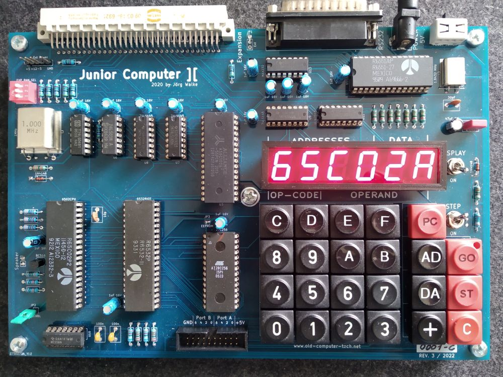

# Junior Computer ][ (JC2)

Junior Computer ][ Hardware and Software

## Some History

In May 1980 the dutch Elektor magazine (org. Elektuur) published the Junior Computer, developed by Alois (Loys) Nachtmann.
The Junior was a little single board computer in the style of the MOS/Commodore KIM-1.
It featured a hex keyboard and a seven segment display, 1KB RAM and 1KB ROM with the so called Print Monitor.
The computer was driven by the MOS 6502 CPU with a clock speed of 1MHz. The peripheral IC 6532, a so-called RIOT (RAM/IO/Timer), was used for input and output.
All in all, the Junior Computer was a nice little tool that gave ambitious hobby electronics enthusiasts access to programming the 
6502 CPU and enabled them to take their first steps in the world of computer-controlled electronics. 
For many people in the 1980s, the Elektor Junior Computer was the Arduino of its time.

I never had one of those wonderful little machines back in these days, but I always wanted one...

40 years later, in January 2020, I decided to make a 40th anniversary edition of the Junior.
This time it should have more memory and a better method to insert code than with the hex keyboard, but without destroying all the glory of it's original functionality.
So I gave it a whopping 32 KB of RAM, 8 KB of ROM with an extended print monitor, and a serial interface for connecting a VT100-compatible terminal.

The Junior Computer ][ was born. 

## The Project

For now the Junior Computer ][ has evolved various stages and some additional hardware is developed for it.

The computer it self has up to 128KB of memory. The IO-/Language card offers you a real time clock, additional parallel IO ports, 
an I2C interface, a parallel printer port, a connector for an ASCII keyboard and a Commodore Datasette drive, a 76489 sound chip, a SD-Card slot and the ability 
to program in BASIC using the EhBASIC interpreter from, the to early past away, Lee Davidson.

The Floppy-/Graphics-Controller, which is still under development, also offers you a PS/2 keyboard connection, a joystick port, a composite and RGB monitor output, and a floppy disk drive interface.

A retro style ASCII keyboard, specially developed for the Junior Computer, is also available.

There is a fork from [Emile](https://github.com/Emile666/JC2) which offers some very interesting extra features.

## Software

- M/OS 65, my little disk operating system for accessing files on SD-Card and floppy disks, is in a very early stage but already usable for loading files.

- Dietrich Lausberg ported his [CPM-65](https://github.com/Dietrich-L/CPM-65_for_JUNIOR_COMPUTER_II) to the Junior Computer][.

- Marko Lauke's port of Pacman for the [Steckschwein](https://www.steckschwein.de/) (another great new 6502 computer) is still in progress, but already looks very promising.
